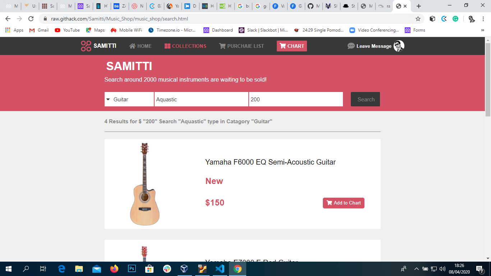

# Music_Shop

This project is a part of the Microverse course HTML and CSS capstone project. In this project I used a prototype electronics shop design and customize it to my music shop website.

 
 

## Built With

- Html,
- Css
- Flexbox

[Live Demo Link](https://raw.githack.com/Samitti/Music_Shop/music_shop/index.html)
[Live Demo Link](https://raw.githack.com/Samitti/Music_Shop/music_shop/search.html)

## About

Th aim of the project is to build a responsive web page using all the skils we have learned on HTML and CSS. I am suposed to use a provided prototype of electronisc shop website and castomise it to my own music shop website. There are two pages for this project, the home page and the search result page. They are also responsive for smaller screen sizes.

## Author

👤 **Samuel Teweldebrhan Ghebremeskel**

- Github: [@githubhandle](https://github.com/Samitti)
- Twitter: [@twitterhandle](https://twitter.com/Samuel63734232)
- Linkedin: [linkedin](https://www.linkedin.com/in/samuel-ghebremeskel-29685811a/)

## 🤝 Contributing

Contributions, issues and feature requests are welcome!

Feel free to check the [issues page](https://github.com/Samitti/Newsweek-clone/issues).

## Show your support

Give a ⭐️ if you like this project!

