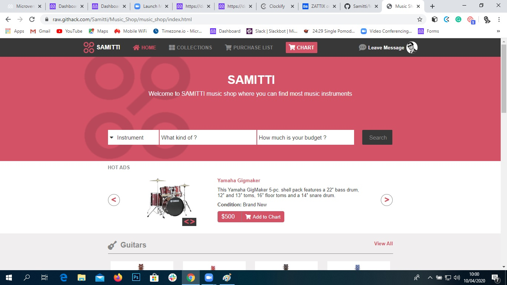
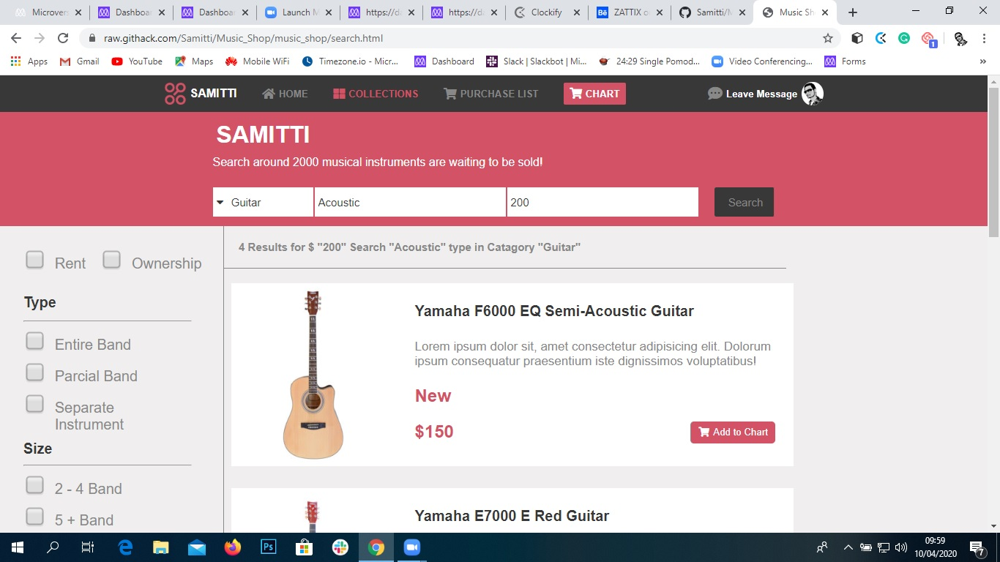

# Music_Shop

This is the HTML and CSS capstone project. It consists of building a responsive website for music shop . It has two  responsive pages- a Homepage and a Search result page.

 
 

## Built With

- Html,
- Css
- Flexbox

[Live Demo Link](https://raw.githack.com/Samitti/Music_Shop/music_shop/index.html)

## Author

👤 **Samuel Teweldebrhan Ghebremeskel**

- Github: [@githubhandle](https://github.com/Samitti)
- Twitter: [@twitterhandle](https://twitter.com/Samuel63734232)
- Linkedin: [linkedin](https://www.linkedin.com/in/samuel-ghebremeskel-29685811a/)

## 🤝 Contributing

Contributions, issues and feature requests are welcome!

Feel free to check the [issues page](https://github.com/Samitti/Newsweek-clone/issues).

## Show your support

Give a ⭐️ if you like this project!
